# ☕ Coffee Order System

> 다중 서버 환경을 고려해 포인트 잔액과 주문 데이터의 정합성을 지키는 커피숍 주문·결제 백엔드

### 핵심 결과

| 검증 항목 | 결과 |
| --- | --- |
| 동시 충전 100건 | 100P × 100건 → 최종 잔액 10,000P |
| 비관적 락 제거 비교 | 기대 10,000P → 실제 1,100P로 Lost Update 재현 |
| 동시 주문 10건 | 4,500P 주문 10건 중 2건 성공 · 8건 거절 · 최종 잔액 1,000P |

## 목차

1. [프로젝트 소개](#1-프로젝트-소개)
2. [기술 스택](#2-기술-스택)
3. [핵심 흐름](#3-핵심-흐름)
4. [주요 기능](#4-주요-기능)
5. [ERD](#5-erd)
6. [API 명세](#6-api-명세)
7. [디렉토리 구조](#7-디렉토리-구조)
8. [설계 의도 및 기술적 선택 이유](#8-설계-의도-및-기술적-선택-이유)
9. [선택한 문제 해결 전략 및 분석](#9-선택한-문제-해결-전략-및-분석)
10. [테스트 및 검증](#10-테스트-및-검증)
11. [한계 및 개선 방향](#11-한계-및-개선-방향)
12. [개발 및 Git 관리](#12-개발-및-git-관리)
13. [실행 방법](#13-실행-방법)

## 1. 프로젝트 소개

다중 서버 환경을 전제로 한 커피숍 주문·결제 백엔드 개인 과제입니다.

메뉴 조회, 포인트 충전, 포인트 주문·결제, 최근 7일 인기 메뉴 TOP 3 조회까지 4개의 API를 구현했습니다.

같은 사용자의 충전·주문 요청이 여러 서버에서 동시에 들어와도 포인트 잔액과 주문 데이터의 정합성이 깨지지 않게 하는 것을 가장 중요한 목표로 삼았습니다.

ERD·API 설계부터 트랜잭션 처리, 비관적 락 기반 동시성 제어, 커밋 이후 데이터 수집 플랫폼 전송(Mock), 동시성 테스트까지 전 과정을 직접 구현하고 검증했습니다.

---

## 2. 기술 스택

| 구분 | 기술 |
| --- | --- |
| Language | Java 17 |
| Framework | Spring Boot 4.1.1, Spring MVC, Bean Validation |
| Persistence | Spring Data JPA, Hibernate 7 |
| Database | MySQL 8.4 |
| Transaction / Event | Spring Transaction, `@TransactionalEventListener` |
| Test | JUnit 6 (Jupiter), AssertJ, Spring Boot Test |
| Build | Gradle, Lombok |
| Tools | IntelliJ IDEA, Postman, Git, GitHub |

---

## 3. 핵심 흐름

### 주문·결제 흐름

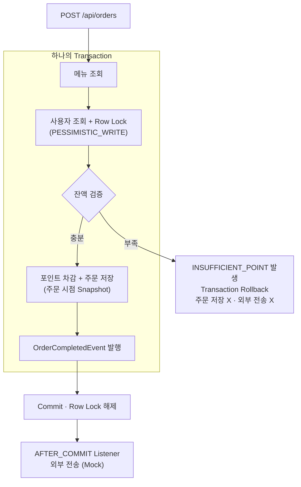
포인트 차감과 주문 저장은 하나의 트랜잭션으로 묶고, 외부 전송은 커밋이 끝난 뒤에만 실행합니다.

---

## 4. 주요 기능

| 기능 | API | 설명 |
| --- | --- | --- |
| ☕ 메뉴 조회 | `GET /api/menus` | 전체 메뉴의 ID, 이름, 가격을 조회합니다. |
| 💰 포인트 충전 | `POST /api/points/charge` | 포인트를 충전하며, 같은 사용자의 동시 요청에도 잔액 정합성을 유지합니다. |
| 🧾 주문·결제 | `POST /api/orders` | 포인트를 차감해 주문을 저장하고, 커밋 후 주문 내역을 데이터 수집 플랫폼(Mock)으로 전송합니다. |
| 📊 인기 메뉴 TOP 3 | `GET /api/menus/popular` | 최근 7일간 주문 횟수가 많은 메뉴를 상위 최대 3개까지 조회합니다. |

---

## 5. ERD

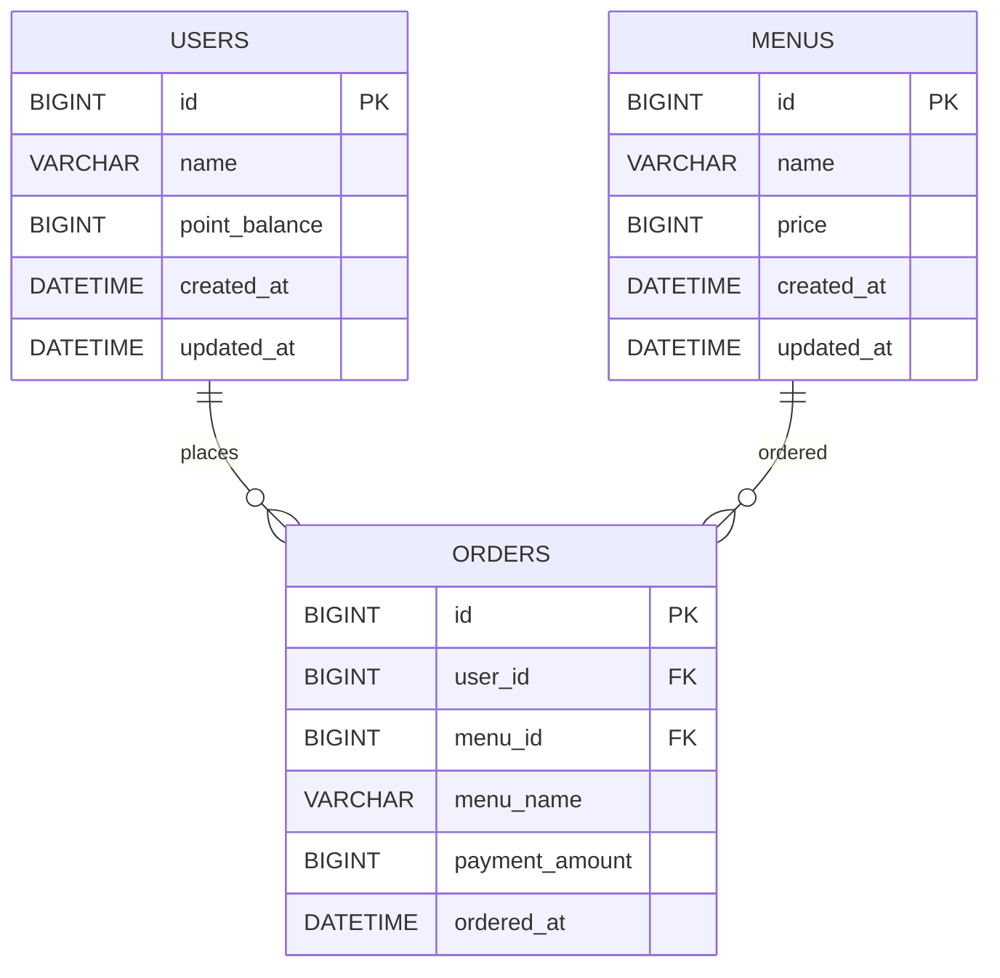

- **포인트 잔액**: 별도 테이블 없이 `users.point_balance`에 저장하며, `CHECK (point_balance >= 0)`으로 음수를 막습니다.
- **주문 Snapshot**: `orders.menu_name`, `payment_amount`에 주문 시점의 메뉴명과 결제 금액을 저장합니다.
- **인덱스**: 최근 7일 주문 집계를 위해 `orders (ordered_at, menu_id)` 인덱스를 두었습니다.

---

## 6. API 명세

| Method | URL | Request Body | Success |
| --- | --- | --- | --- |
| `GET` | `/api/menus` | - | `200 OK` |
| `POST` | `/api/points/charge` | `userId`, `amount` | `200 OK` |
| `POST` | `/api/orders` | `userId`, `menuId` | `201 Created` |
| `GET` | `/api/menus/popular` | - | `200 OK` |

<details>
<summary>☕ 메뉴 조회 요청/응답 예시</summary>

**Request**

```http
GET /api/menus
```

**Response** `200 OK` (예시 일부)

```json
[
  { "menuId": 1, "name": "아메리카노", "price": 4500 },
  { "menuId": 2, "name": "카페라떼", "price": 5000 }
]
```

</details>

<details>
<summary>💰 포인트 충전 요청/응답 예시</summary>

**Request**

```http
POST /api/points/charge
Content-Type: application/json

{
  "userId": 1,
  "amount": 10000
}
```

**Response** `200 OK`

```json
{
  "userId": 1,
  "chargedAmount": 10000,
  "pointBalance": 10000
}
```

</details>

<details>
<summary>🧾 주문·결제 요청/응답 예시</summary>

**Request**

```http
POST /api/orders
Content-Type: application/json

{
  "userId": 1,
  "menuId": 1
}
```

**Response** `201 Created`

```json
{
  "orderId": 1,
  "userId": 1,
  "menuId": 1,
  "menuName": "아메리카노",
  "paymentAmount": 4500,
  "pointBalance": 5500,
  "orderedAt": "2026-10-06T12:13:14.4846924"
}
```

</details>

<details>
<summary>📊 인기 메뉴 TOP 3 요청/응답 예시</summary>

**Request**

```http
GET /api/menus/popular
```

**Response** `200 OK`

```json
[
  { "rank": 1, "menuId": 1, "name": "아메리카노", "orderCount": 3 },
  { "rank": 2, "menuId": 2, "name": "카페라떼", "orderCount": 3 },
  { "rank": 3, "menuId": 3, "name": "바닐라라떼", "orderCount": 2 }
]
```

요청 시각 기준 최근 7일의 주문을 집계하며, 주문 횟수가 같으면 `menuId`가 작은 메뉴가 앞에 옵니다.

</details>

### 오류 응답

비즈니스 예외와 요청값 검증 오류는 `code`, `message` 형식으로 응답합니다.

```json
{
  "code": "INSUFFICIENT_POINT",
  "message": "포인트가 부족합니다."
}
```

| ErrorCode | HTTP Status | 발생 조건 | 발생 API |
| --- | --- | --- | --- |
| `INVALID_REQUEST` | `400 Bad Request` | 필수 요청값이 누락된 경우 | 충전, 주문 |
| `INVALID_CHARGE_AMOUNT` | `400 Bad Request` | 충전 금액이 0 이하인 경우 | 충전 |
| `INSUFFICIENT_POINT` | `400 Bad Request` | 보유 포인트가 메뉴 가격보다 적은 경우 | 주문 |
| `USER_NOT_FOUND` | `404 Not Found` | 사용자가 존재하지 않는 경우 | 충전, 주문 |
| `MENU_NOT_FOUND` | `404 Not Found` | 메뉴가 존재하지 않는 경우 | 주문 |

---

## 7. 디렉토리 구조

```text
src/main/java/com/nbcamp/coffeeordersystem
│
├── domain
│   ├── menu            # 메뉴 조회 · 인기 메뉴 조회
│   ├── user            # 사용자 · 포인트 관리
│   └── order           # 주문·결제 · 이벤트 · 외부 전송(Mock)
│
├── common
│   ├── config          # JPA Auditing
│   ├── entity          # 공통 BaseTimeEntity
│   └── exception       # 공통 예외 처리
│
└── CoffeeOrderSystemApplication.java

src/test
├── java                # 포인트·주문 동시성 테스트
└── resources           # 테스트 전용 DB 설정

sql
├── schema.sql          # DB 스키마
└── data.sql            # 초기 데이터
```

---

## 8. 설계 의도 및 기술적 선택 이유

- **사용자 잔액을 `users.point_balance`에 저장**
    - 별도 포인트 테이블도 검토했지만, 포인트 이력·만료 요구사항이 없어 현재 잔액만 관리했습니다. 사용자 Row가 곧 락 대상이 되어 구조도 단순해집니다.


- **비관적 락 `PESSIMISTIC_WRITE`**
    - `synchronized`, 낙관적 락, Redis 분산 락을 대안으로 검토했습니다. `synchronized`는 서버 한 대 안에서만 유효하고, 낙관적 락은 충돌 시 재시도 로직이 필요하며, Redis 분산 락은 추가 인프라가 필요합니다. DB Row Lock은 여러 서버가 공유하는 DB에 직접 적용되므로 추가 구성 없이 다중 서버에서도 동작합니다.


- **포인트 차감 + 주문 저장 단일 트랜잭션**
    - 차감과 주문 저장을 각각 처리하면 한쪽만 반영되는 중간 상태가 생길 수 있습니다. 두 작업을 하나의 `@Transactional`로 묶어 예외 발생 시 함께 Rollback되도록 했습니다.


- **주문 시점 Snapshot 저장**
    - 조회 시 현재 `menus` 정보를 사용하는 대신, 주문에 `menu_name`, `payment_amount`를 별도로 저장했습니다. 메뉴명이나 가격이 이후 변경되어도 주문 당시의 정보를 유지할 수 있습니다.


- **`@TransactionalEventListener(AFTER_COMMIT)` 기반 외부 전송**
    - 트랜잭션 내부에서 직접 외부 전송하는 대신, Commit이 완료된 뒤 데이터 수집 플랫폼(Mock)으로 전송하도록 분리했습니다. Rollback된 주문은 전송되지 않고, 외부 전송 실패가 이미 완료된 주문을 되돌리지 않습니다.


- **`@Async` 미적용**
    - 비동기 전송도 검토했지만 Mock 전송이라 별도의 지연이 없어 적용하지 않았습니다. 이번 과제에서는 스레드 풀 설정과 비동기 예외 처리 복잡도를 추가하지 않는 쪽을 선택했습니다.


- **DB 기반 인기 메뉴 집계**
    - 서버 메모리 카운터, Redis 캐시, 별도 집계 테이블 대신 `orders`를 `GROUP BY + COUNT`로 집계했습니다. 서버별 메모리 값이 달라지는 문제를 피하고, 공유 DB의 주문 데이터를 단일 기준으로 사용해 정확성을 우선했습니다.


- **`ddl-auto: validate` + `sql/schema.sql`**
    - `ddl-auto: update`로 스키마를 자동 변경하지 않고, CHECK 제약과 인덱스를 SQL에서 직접 관리했습니다. 애플리케이션 실행 시에는 엔티티와 실제 DB 스키마가 일치하는지만 검증하도록 구성했습니다.

---

## 9. 선택한 문제 해결 전략 및 분석

### 문제 1. 동시 충전 시 Lost Update

- **문제**: 같은 사용자의 충전 요청이 동시에 처리되면 일부 충전 금액이 최종 잔액에 반영되지 않을 수 있습니다.
- **원인**: 여러 트랜잭션이 같은 `point_balance`를 읽은 뒤 각자 계산한 값을 저장하면, 나중에 실행된 UPDATE가 앞선 결과를 덮어씁니다.
- **전략**: 사용자 조회 시 `PESSIMISTIC_WRITE`(`SELECT ... FOR UPDATE`)로 Row를 잠급니다. 먼저 락을 획득한 트랜잭션이 Commit할 때까지 다음 트랜잭션이 대기하므로, 같은 사용자의 잔액 변경이 직렬화됩니다.

### 문제 2. 동시 주문 시 포인트 초과 사용

- **문제**: 잔액 10,000P인 사용자가 4,500P 주문을 동시에 여러 건 요청하면 보유 포인트보다 많은 주문이 성공할 수 있습니다.
- **원인**: 여러 트랜잭션이 차감 전의 같은 잔액을 확인하면, 모두 "결제 가능"으로 판단한 뒤 각자 차감하고 주문을 저장합니다.
- **전략**: 주문에서도 같은 사용자 Row에 비관적 락을 획득한 뒤 잔액 검증 → 차감 → 주문 저장을 하나의 트랜잭션에서 처리합니다. 뒤따르는 트랜잭션은 앞선 Commit이 반영된 잔액으로 검증하므로, 부족하면 `INSUFFICIENT_POINT`로 거절됩니다. 충전과 주문이 같은 Row를 잠그기 때문에 두 요청이 동시에 들어와도 직렬화됩니다.

### 문제 3. 주문 트랜잭션과 외부 전송의 불일치

- **문제**: Rollback된 주문이 외부 데이터 수집 플랫폼에 전달되거나, 외부 전송 실패 때문에 정상 주문이 실패할 수 있습니다.
- **원인**: Commit이 확정되기 전에 트랜잭션 안에서 전송하면, 이후 Rollback되어도 이미 전송된 데이터는 되돌릴 수 없습니다. 반대로 전송 중 발생한 예외는 주문 트랜잭션까지 Rollback시킵니다.
- **전략**: 트랜잭션 안에서는 주문 완료 이벤트만 발행하고, `@TransactionalEventListener(AFTER_COMMIT)`에서 전송해 Commit된 주문만 데이터 수집 플랫폼(Mock)으로 전달합니다. 전송 중 예외는 리스너에서 잡아 로그로 남깁니다.

### 문제 4. 다중 서버에서 인기 메뉴 집계 불일치

- **문제**: 각 서버가 메모리에서 주문 횟수를 따로 관리하면, 요청이 어느 서버로 들어갔는지에 따라 인기 메뉴 결과가 달라질 수 있습니다.
- **원인**: 애플리케이션 인스턴스의 메모리는 서로 공유되지 않으므로, 각 서버는 전체 주문 데이터를 알 수 없습니다.
- **전략**: 모든 서버가 공유하는 `orders` 테이블을 기준으로 최근 7일 주문을 `GROUP BY + COUNT`로 집계합니다. 동률은 `menu_id` 오름차순으로 순서를 고정해, 같은 데이터에서는 어느 서버에서든 같은 결과가 나옵니다.

각 전략의 검증 결과는 [10. 테스트 및 검증](#10-테스트-및-검증)에 정리했습니다.

---

## 10. 테스트 및 검증

동시성 테스트는 개발 DB와 분리한 `coffee_order_test`에서 `ExecutorService`와 `CountDownLatch`로 실행했습니다.

| 검증 항목 | 방식 | 조건 | 결과 |
| --- | --- | --- | --- |
| 동시 포인트 충전 | 자동 테스트 | 100P 충전 100건 병렬 실행 | 최종 잔액 `10,000P` · PASS |
| 비관적 락 제거 비교 | 수동 실험 | 같은 테스트에서 `findByIdForUpdate()`를 `findById()`로 임시 변경 | 기대 `10,000P` → 실제 `1,100P` · Lost Update 재현 |
| 동시 주문 | 자동 테스트 | 잔액 `10,000P`, 4,500P 주문 10건 병렬 실행 | 성공 `2건` · 포인트 부족 `8건` · 최종 잔액 `1,000P` · 주문 `2건` |
| 주문 성공·실패 비교 | 수동 확인 | 정상 주문과 포인트 부족 주문을 요청한 뒤 로그 확인 | 정상 주문만 Commit 후 외부 전송(Mock) · 실패 주문은 저장 X · 차감 X · 전송 X |
| 인기 메뉴 TOP 3 | 수동 확인 | API 응답과 같은 조건의 DB 집계 쿼리 비교 | 순위와 주문 횟수 일치 · 동률 시 `menuId` 오름차순 · 8일 전 주문 제외 |

### 핵심 동시성 검증

**비관적 락 제거: Lost Update 재현**

100P 충전 100건의 기대 잔액은 10,000P였지만, 락을 제거하자 일부 충전만 반영되어 실제 잔액은 1,100P에 그쳤습니다.

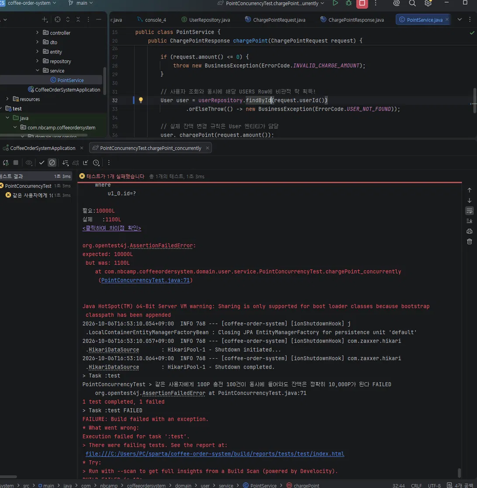

이 값은 실행마다 달라지며 위는 1회 실행 결과입니다. 락을 제거한 코드는 실험 후 되돌려 저장소에는 포함하지 않았습니다.

**비관적 락 적용: 테스트 통과**

| 동시 충전 (최종 잔액 10,000P) | 동시 주문 (성공 2건 · 잔액 1,000P) |
| --- | --- |
| 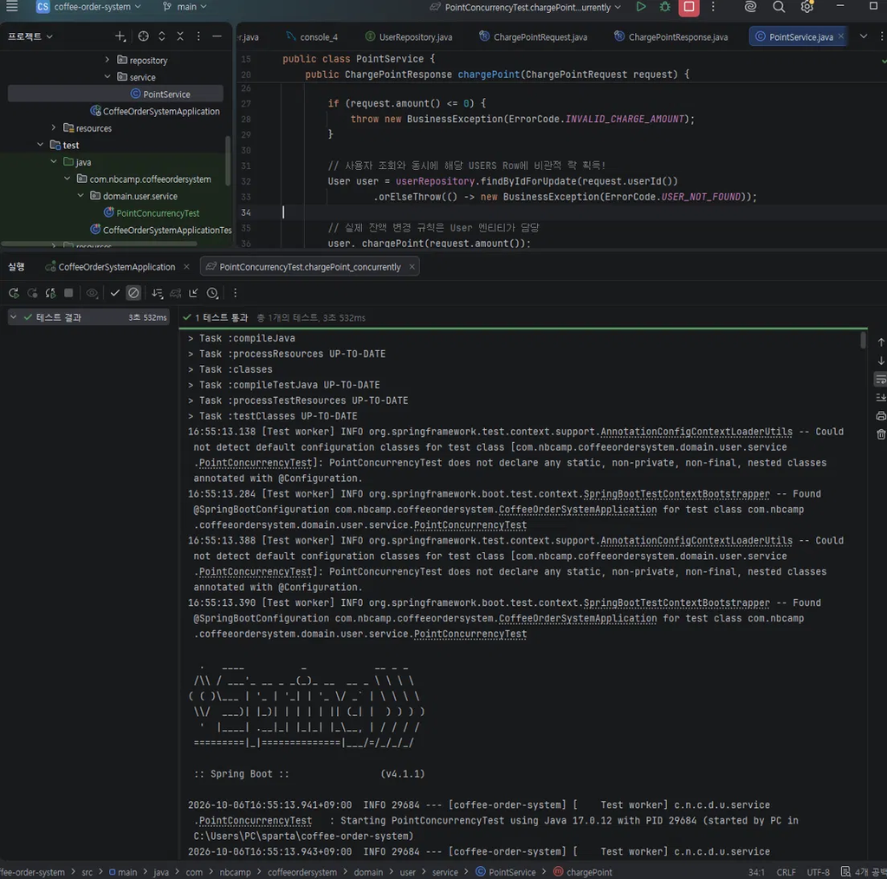 | 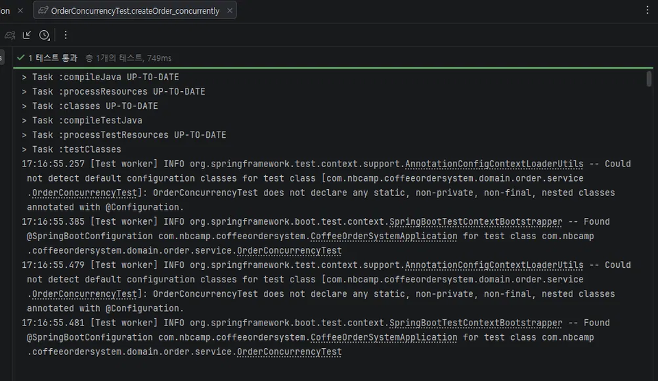 |

<details>
<summary>동시성 테스트 추가 증거 보기</summary>

**동시 충전 후 테스트 DB 잔액 (10,000P)**

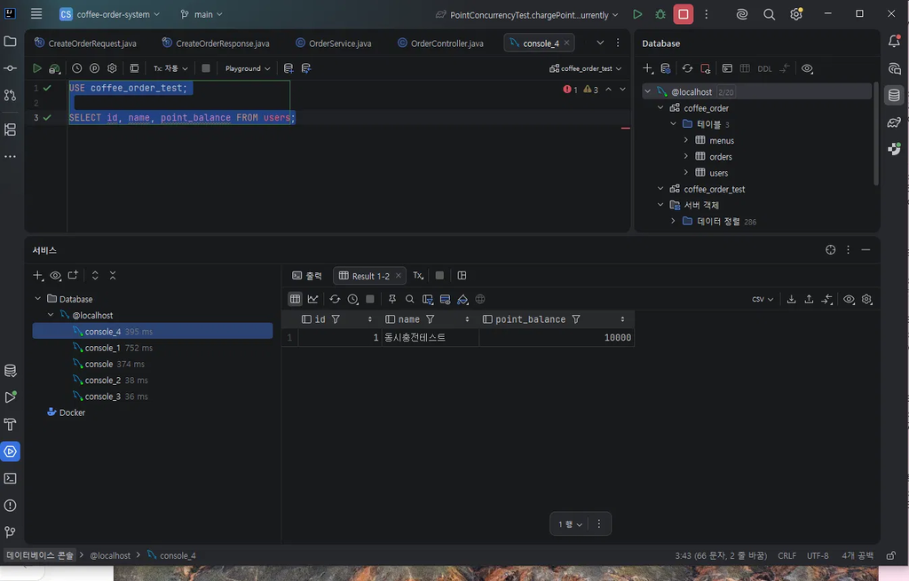

**동시 주문 후 테스트 DB 주문 내역 (2건)**

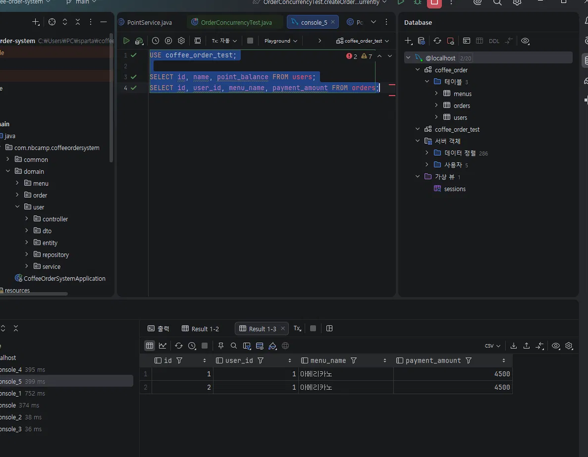

**동시 주문 중 외부 전송 로그 (성공한 2건만 전송)**

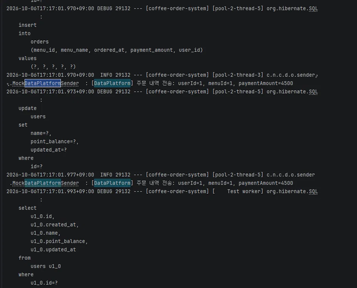

</details>

<details>
<summary>주문 성공 · 실패 검증 보기</summary>

**정상 주문 (201 Created)**

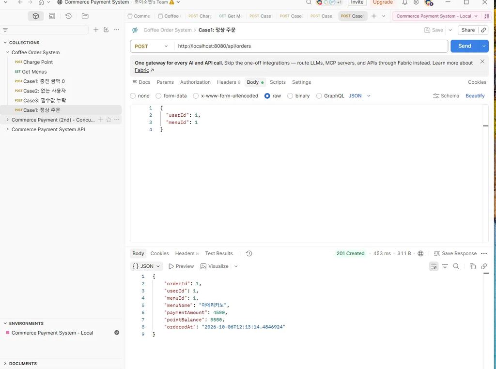

**주문 후 DB 잔액 (10,000P → 5,500P)**

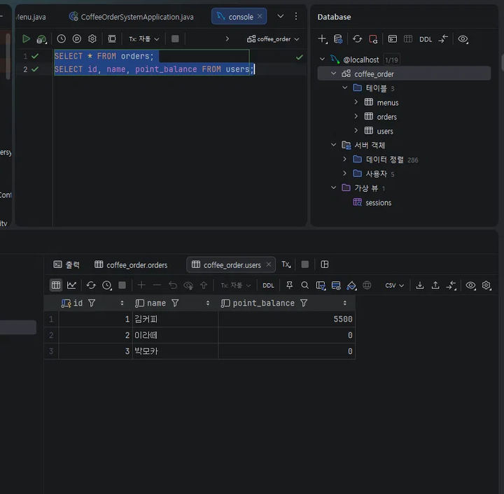

**포인트 부족 주문 (400 Bad Request)**

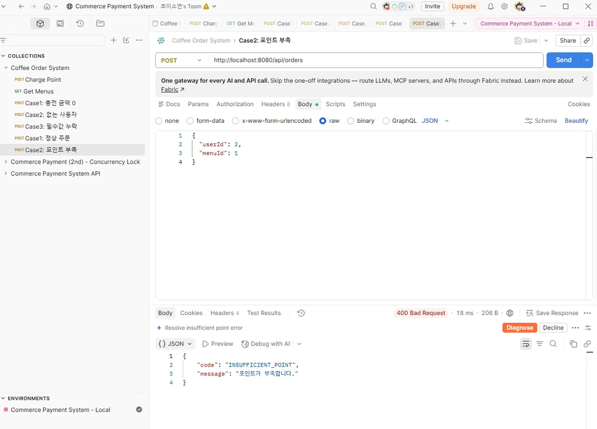

</details>

<details>
<summary>인기 메뉴 TOP 3 검증 보기</summary>

`GET /api/menus/popular` 응답은 아메리카노 3건 · 카페라떼 3건 · 바닐라라떼 2건이었고, 같은 조건의 DB 집계 결과와 일치했습니다.

**API가 실행한 SQL (`group by`, `order by`, `limit`)**

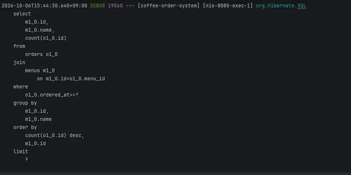

**DB 직접 집계 결과**

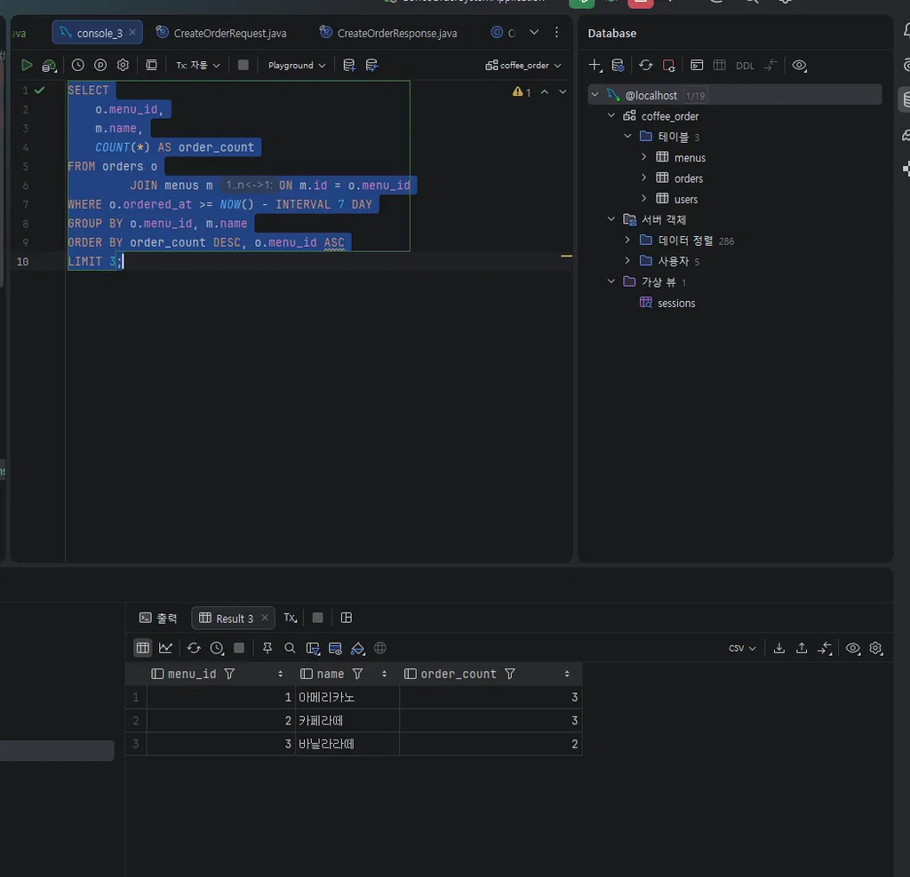

</details>

---

## 11. 한계 및 개선 방향

| 현재 한계 | 개선 방향 |
| --- | --- |
| 동시성 테스트를 서버 1대의 멀티스레드로만 검증했고, 인스턴스 2대 이상에서는 실행해 보지 못함 | 같은 DB를 바라보는 인스턴스 2대를 띄워 동시 요청 검증 |
| 같은 주문 요청이 반복되면 중복 결제가 발생할 수 있음 | `Idempotency-Key`를 도입해 동일 요청의 중복 처리 방지 |
| 외부 전송이 실패하거나 Commit 직후 서버가 종료되면 이벤트가 유실되고 재전송되지 않음 | Transactional Outbox와 재시도 또는 Message Queue 도입 |
| 외부 전송이 동기 방식이라 실제 외부 API가 지연되면 주문 응답도 지연됨 | 비동기 처리 또는 별도 전송 Worker 구성 |
| 같은 사용자의 요청이 몰리면 Row Lock 대기 시간이 길어질 수 있음 | 락 타임아웃 정책을 설정하고, 타임아웃 발생 시 예외 응답을 정의 |
| 인기 메뉴를 조회할 때마다 최근 7일 주문을 매번 집계함 | 데이터 증가 시 일별 집계 구조를 검토하거나, 허용 가능한 최신성 범위가 있다면 짧은 TTL의 Redis Cache 적용 |
| 포인트의 현재 잔액만 저장해 변경 이력을 확인할 수 없음 | `PointHistory`를 분리해 충전·사용 이력 기록 |
| 인기 메뉴 조회와 외부 전송 실패 상황은 자동 테스트가 없음 | 7일 경계·동률 테스트와 전송 실패를 가정한 테스트 추가 |

---

## 12. 개발 및 Git 관리

개인 과제이므로 `main` 단일 브랜치에서 작업했으며, 기능·설정·테스트 등 하나의 변경 목적이 명확해질 때 단위별로 커밋했습니다.

| Type | 용도 | 실제 커밋 예시 |
| --- | --- | --- |
| `chore` | 프로젝트 설정 | `chore: initialize coffee order system project` |
| `feat` | 기능 구현 | `feat: implement point charge API with pessimistic lock` |
| `refactor` | 구조 변경 | `refactor: move MenuController to menu controller package` |
| `test` | 테스트 | `test: add order concurrency test` |
| `docs` | 문서 | `docs: add README draft with design and test results` |

DB 비밀번호는 `.env`로 분리하고 `.gitignore`에 등록해 저장소에 포함되지 않도록 관리했습니다.

---

## 13. 실행 방법

### 요구 사항

- Java 17
- MySQL 8.x

### 1. 데이터베이스 준비

MySQL 관리자 계정으로 데이터베이스와 애플리케이션 계정을 만듭니다.

```sql
CREATE DATABASE coffee_order;
CREATE DATABASE coffee_order_test;

CREATE USER 'coffee'@'localhost' IDENTIFIED BY '<your-password>';

GRANT ALL PRIVILEGES ON coffee_order.* TO 'coffee'@'localhost';
GRANT ALL PRIVILEGES ON coffee_order_test.* TO 'coffee'@'localhost';
```

이어서 `sql/schema.sql` → `sql/data.sql` 순서로 실행해 애플리케이션 테이블과 초기 데이터를 생성합니다.

### 2. 환경 변수 설정

프로젝트 루트에 `.env` 파일을 만들고 위에서 설정한 MySQL 비밀번호를 입력합니다.

```properties
DB_PASSWORD=<your-password>
```

`.env`는 `.gitignore`에 포함되어 저장소에 커밋되지 않습니다.

### 3. 애플리케이션 실행

```bash
./gradlew bootRun
```

기본적으로 `http://localhost:8080`에서 실행됩니다.

### 4. 테스트 실행

```bash
./gradlew test
```

동시성 테스트는 개발 DB와 분리된 `coffee_order_test`에서 실행됩니다.

테스트 환경에서는 `ddl-auto: create`를 사용하므로 Spring 테스트 컨텍스트가 시작될 때 Entity를 기준으로 테스트 테이블이 자동 생성됩니다.


